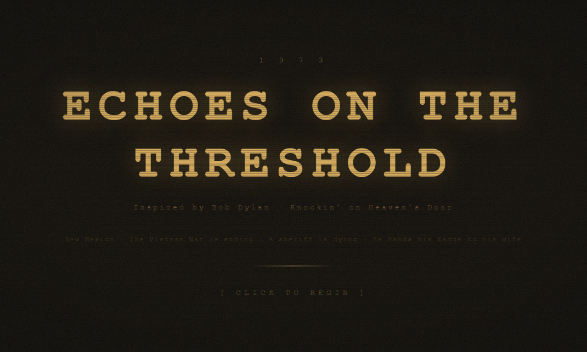
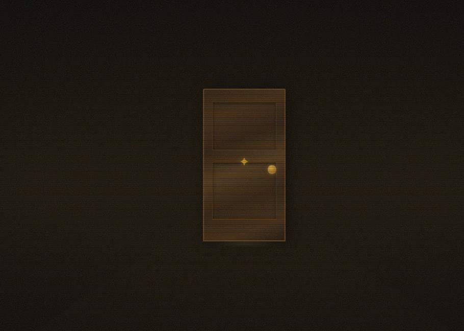
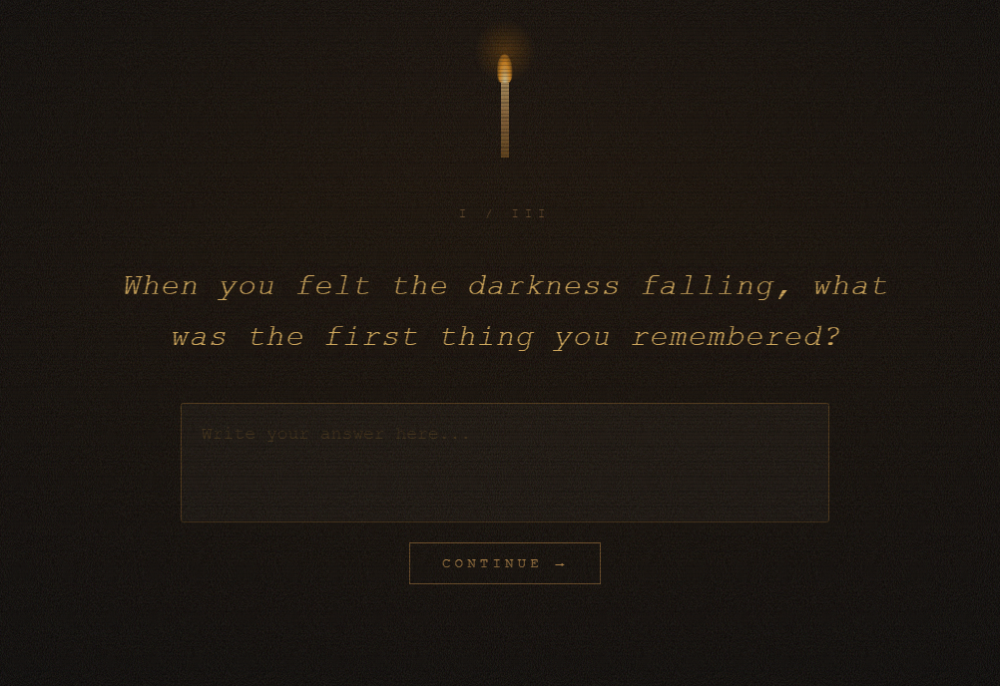
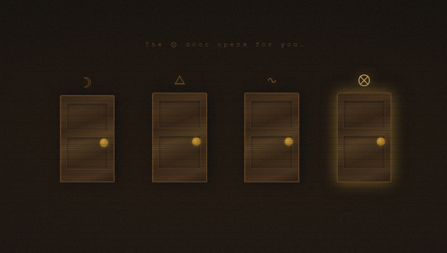
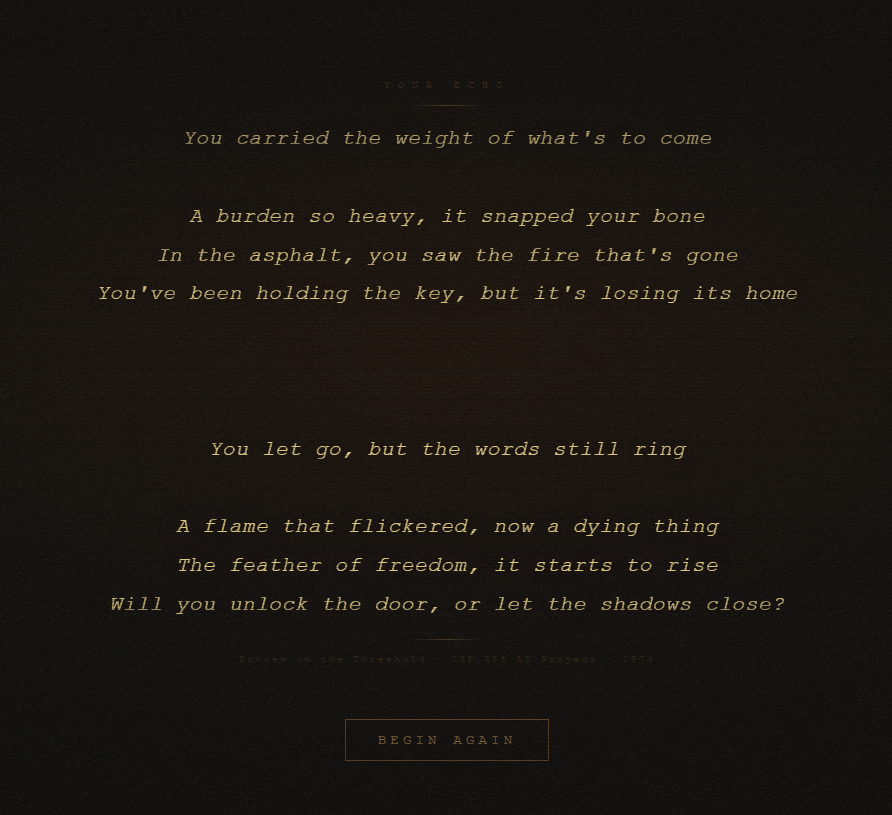

# Echoes on the Threshold

> *"Mama, take this badge off of me — I can't use it anymore."*
> — Bob Dylan, Knockin' on Heaven's Door (1973)

An interactive web experience inspired by Bob Dylan's 1973 composition. The user knocks on a door, answers three philosophical questions spoken by a godlike voice, and receives a personalized poem written by an AI in Dylan's voice — then read aloud as the final revelation.

---

## Artistic Statement

This is not a quiz. It is a threshold.

The questions are not designed to be answered correctly. They are designed to be felt. When you type your response, a neural language model reads the semantic weight of your words — not their literal meaning, but their emotional direction. It measures how far your soul leans toward longing, rage, release, or the past. Three rounds. Three doors. Each one chosen not by you, but by what you carried into your answer.

At the end, a large language model — trained on the full weight of human language — reads the map of your journey and writes a poem for you. Not about you. To you. In the sparse, honest voice of 1973.

---

## Technical Architecture

```
[User Answer] 
     │
     ▼
[TF.js Universal Sentence Encoder]  ← NLP Component
  512-dimensional text embedding
  Cosine similarity vs. 4 anchor texts
  Softmax (temperature=8) → door probabilities
  Full score map: {Moon: 0.72, Flame: 0.18, ...}
     │
     ▼
[Flask Backend / Python]
     │
     ├── [Groq API / Llama-3.1-8b]  ← LLM Component
     │     Journey summary + NLP scores → poem
     │     Dylan/1973 historical context in system prompt
     │
     ▼
[Frontend / JavaScript]
  Poem displayed with pre-line formatting
  Web Speech API TTS (pitch=0.1, rate=0.65)
  Web Audio API — 5-layer drone ambience (A0–A3, convolution reverb)
```

### How the AI components interact

The NLP component does not just select a door — it produces a full probability distribution over all four symbolic doors. This distribution is passed to the LLM as an emotional map:

```
Round 1: "I never let anyone see me cry."
    Soul resonance → Moon 72%  |  Key 18%  |  Flame 7%  |  Feather 3%
```

The LLM reads this map and writes a poem that reflects not just the dominant emotion but the full tension between them. A soul that is 72% longing but 18% rage produces a different poem than one that is 51% longing and 44% rage — even if both chose the Moon door. This is the emergent result of the two AI systems working together.

---

## AI Techniques Used

| Technique | Model / Library | Role |
|---|---|---|
| **Semantic Embedding + Cosine Similarity** | TensorFlow.js Universal Sentence Encoder (512-dim) | Maps user answers to symbolic emotional space; selects which door opens |
| **Large Language Model (Generative)** | Groq API / Llama-3.1-8b-instant | Reads the emotional journey map and generates a personalized poem in Dylan's 1973 voice |
| **Text-to-Speech Synthesis** | Web Speech API (browser-native) | Reads the poem aloud in a deep, slow, reverberant voice |
| **Procedural Audio Synthesis** | Web Audio API | 5-layer harmonic drone (A0–A3) with convolution reverb; underlies the godlike TTS voice |

---

## Installation & Setup

### Requirements

- Python 3.9+
- A modern browser (Chrome recommended for best TTS voice selection)
- A free Groq API key: [console.groq.com](https://console.groq.com)

### Install dependencies

```bash
pip install -r requirements.txt
```

### Set API key

**Windows:**
```cmd
set GROQ_API_KEY=your_key_here
```

**Mac / Linux:**
```bash
export GROQ_API_KEY=your_key_here
```

### Run

```bash
python app.py
```

Open [http://localhost:5000](http://localhost:5000) in your browser.

> The NLP model (Universal Sentence Encoder) is loaded from a CDN on first use. It requires an internet connection and may take 10–20 seconds to initialize on the first run.

---

## Dependencies

```
flask==3.0.3
flask-cors==4.0.1
requests==2.32.3
groq==0.9.0
```

**Frontend (CDN, no install needed):**
- TensorFlow.js 4.17.0
- Universal Sentence Encoder 1.3.3

---

## Project Structure

```
Project2/
├── app.py          # Flask backend — LLM integration (Groq/Llama)
├── main.js         # Frontend engine — NLP, audio, state machine
├── index.html      # 6-screen HTML structure
├── style.css       # 1973 CRT/analog aesthetic
├── requirements.txt
├── README.md
├── MANIFESTO.md
└── audio/
    └── dylan_cover.mp3 
```

---

## The Four Doors

| Symbol | Name | Semantic Anchor |
|---|---|---|
| ☽ | Moon | loss, emptiness, darkness, longing, grief |
| △ | Flame | anger, fire, rage, strength, defiance |
| ∿ | Feather | peace, release, acceptance, surrender, calm |
| ⊗ | Key | past, secrets, memory, hidden truth, regret |

The NLP model computes cosine similarity between the user's answer embedding and each door's anchor text embedding. The result is a probability distribution, not a binary choice — this distribution carries the full emotional texture of the answer into the poem generation stage.

---

## Screenshots

| | |
|---|---|
|  |  |
|  |  |



---

## Example Output

**User journey:**
- *"I have spent my whole life pretending to be certain."* → Key 61% / Moon 24%
- *"The anger people feared in me was never really anger — it was pain."* → Flame 58% / Moon 31%
- *"I think I have known for a while that I don't need to carry any of it."* → Feather 74% / Key 18%

**Generated poem:**
```
You wore certainty like armor in a war
no one declared and no one won.
The rage they saw was just the sound
of something breaking into light.

Now you stand where the road runs out,
badge in hand, too tired to pretend.
The door was always open.
You just had to stop knocking.
```

---

## Notes on the Voice

The poem is read aloud by the browser's speech synthesis engine with `pitch: 0.1` and `rate: 0.65` — the lowest pitch and near-slowest rate the Web Speech API allows. Simultaneously, a five-layer harmonic drone (A0 sub-bass through A3 shimmer, routed through a 10-second convolution reverb) fills the room. The TTS voice cannot be routed through Web Audio — but the drone underneath creates the acoustic illusion of a voice resonating in a vast stone chamber.

---

*CSE 358 Introduction to Artificial Intelligence — Spring 2025–2026*
